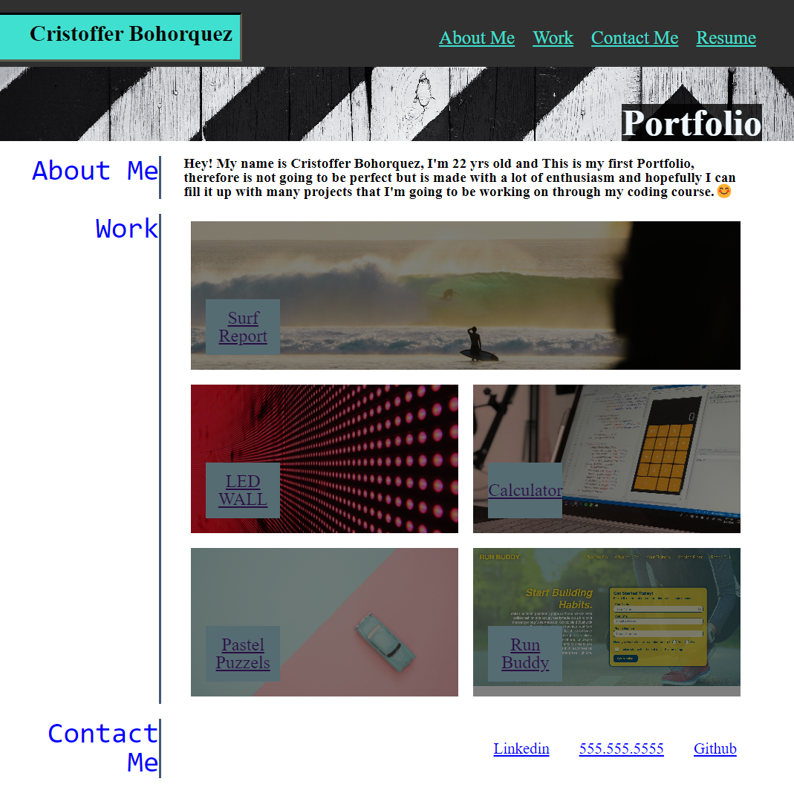

# Portfolio-Cristoffer

<!-- GETTING STARTED -->
## Homework Description

This is a mock up version of a portfolio that we are going to be adding content in the future, it has some clickable links. Css and html are the main factors in this webpage with use of flex as well.

## Content 
- HTML: Added a whole html code from scratch using everything that it was taught from week 1 and 2.
- CSS: Applied advance css to the function with images and flex display. Also added the feature of reset css.

## Link
[Cristoffer-Portfolio](https://cristofferb7.github.io/horiseon-1/)

## Screenshot

